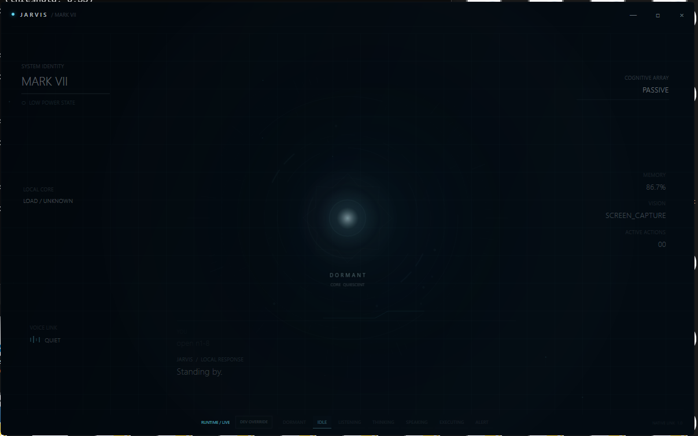
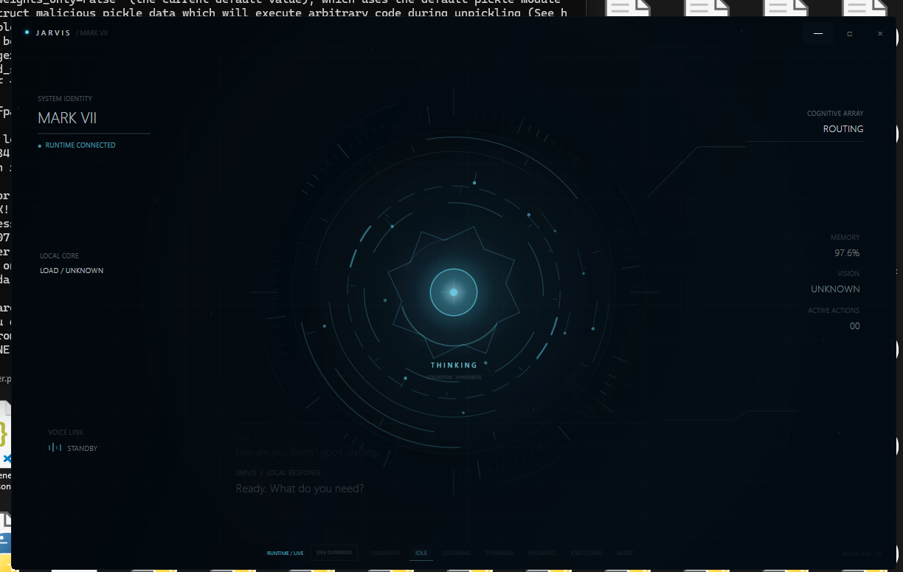

<p align="center">
  
  
  
  
  
  
</p>

<h1 align="center">J.A.R.V.I.S — MARK VIII</h1>

<p align="center">
  <strong>An introspective, deliberative autonomous cognitive architecture with pre-flight counterfactual simulation, adversarial multi-persona deliberation, open-ended skill synthesis, AST codebase introspection, and causal state modeling — engineered for safety, precision, and mission-critical execution.</strong>
</p>

<p align="center">
  Adversarial Deliberation Engine · Pre-Flight Counterfactual Sandbox · Epistemic Entropy Calibration<br/>
  Autonomous Skill Synthesizer (Voyager) · Codebase AST Introspection · Hierarchical Goal DAG · Foveated Saccadic Vision<br/>
  Causal World State Predictor · Experience Distillation · Canary Self-Healing CI/CD · Native WPF Holographic HUD
</p>

---

## 📸 Runtime HUD & Interface

<p align="center">
  
  <br/>
  <em><strong>Figure 1: Native WPF Desktop Client in Live Speaking State</strong> — Real-time telemetry showing active cognitive routing to <code>OLLAMA: JARVIS:LATEST</code>, memory footprint tracking (92.6%), screen capture vision verification, and streaming vocal output channel.</em>
</p>

<p align="center">
  
  <br/>
  <em><strong>Figure 2: Cognitive Synthesis & Routing</strong> — Multi-model brain evaluating query complexity, routing intent between local and cloud reasoning tiers, and updating active cognitive array status in real time.</em>
</p>

<p align="center">
  
  <br/>
  <em><strong>Figure 3: Quiescent Low-Power State</strong> — HUD idling in low-power dormant mode with acoustic double-clap wake detection armed and background system resource monitoring active.</em>
</p>

---

## 🏛️ MARK VIII Core Cognitive Architecture

J.A.R.V.I.S. MARK VIII transitions the system into an introspective, deliberative cognitive architecture:

```
                                  ┌────────────────────────┐
                                  │      USER INTENT       │
                                  │  Voice · Web · Desktop │
                                  └───────────┬────────────┘
                                              │
                                              ▼
 ┌────────────────────────────────────────────────────────────────────────────────────────┐
 │                    ① ADVERSARIAL DELIBERATION ENGINE (deliberation.py)                 │
 │                                                                                        │
 │   ┌───────────────────────┐   ┌──────────────────────────┐   ┌─────────────────────┐   │
 │   │   ARCHITECT PERSONA   │──▶│    RED-TEAM SCEPTIC      │──▶│    JUDGE ARBITER    │   │
 │   │ Formulates structured │   │ Adversarially audits for │   │ Evaluates critiques │   │
 │   │ multi-step execution  │   │ destructive commands,    │   │ modifies plans with │   │
 │   │ candidate proposals   │   │ path traversal & leaks   │   │ guardrails/rejects  │   │
 │   └───────────────────────┘   └──────────────────────────┘   └──────────┬──────────┘   │
 └─────────────────────────────────────────────────────────────────────────┼──────────────┘
                                                                           │
                                              ┌────────────────────────────┴──────────────┐
                                              │ [APPROVED / GUARDED]                      │
                                              ▼                                           ▼
 ┌─────────────────────────────────────────────────────────┐                     ┌────────────────┐
 │        ② COUNTERFACTUAL PRE-FLIGHT SIMULATOR            │                     │  [REJECTED]    │
 │                (preflight_simulator.py)                 │                     │ Execution      │
 │                                                         │                     │ Aborted Safely │
 │   • Ephemeral Isolation Sandbox (tempfile.mkdtemp())    │                     └────────────────┘
 │   • Shadow-Copies Target Read/Write Files               │
 │   • Dry-Run Execution with Mocked Network/Filesystem    │
 │   • Asserts Exit Code 0 & Verifies State Diff           │
 └────────────────────────────┬────────────────────────────┘
                              │
                              ▼
 ┌─────────────────────────────────────────────────────────┐
 │       ③ AUTONOMOUS SKILL SYNTHESIS & EXECUTION          │
 │         (skill_synthesizer.py & executor.py)            │
 │                                                         │
 │   • Voyager open-ended procedural code generation       │
 │   • Self-healing preflight validation & auto-patching   │
 │   • Dynamic hot-reloading into runtime skills registry  │
 │   • Hierarchical Goal Management DAG (goal_manager.py)  │
 └────────────────────────────┬────────────────────────────┘
                              │
                              ▼
 ┌─────────────────────────────────────────────────────────┐
 │         ④ CAUSAL GROUNDING & EXPERIENCE HARVEST         │
 │     (causal_engine.py & experience_distiller.py)        │
 │                                                         │
 │   • Forward State Prediction (S_t ──▶ \hat{S}_{t+1})    │
 │   • StateSurpriseException on Causal Divergence         │
 │   • Foveated Saccadic Screen Grounding (High-DPI)       │
 │   • Distilled ShareGPT/Alpaca offline training export   │
 └─────────────────────────────────────────────────────────┘
```

---

### 1. ⚔️ Adversarial Deliberation Engine (`deliberation.py`)
High-complexity, destructive, or ambiguous plans undergo a multi-persona adversarial audit before execution:
1. **Architect Persona:** Proposes a structured multi-step execution strategy.
2. **Red-Team Sceptic Persona:** Proactively probes for destructive filesystem operations (`rm -rf`, `del /f`, `format`), path traversals (`../../`), credential exposure (`.env`, `credentials.json`, `token.json`), and fork bombs.
3. **Judge Arbiter:** Synthesizes critiques into three verdicts:
   - **`APPROVED`**: Benign, low-risk requests execute directly.
   - **`MODIFIED_WITH_GUARDRAILS`**: Injects sandboxing, file shadow backups, and 15s execution timeouts.
   - **`REJECTED`**: Aborts critical hazards to preserve system integrity.

### 2. 🧪 Counterfactual Pre-Flight Simulator (`preflight_simulator.py`)
Before code or script commands mutate the live system:
- Spins up an **ephemeral sandbox workspace** (`tempfile.mkdtemp()`).
- Automatically detects referenced files and **shadow-copies** them into the container.
- Dry-runs candidate code in the sandbox with offline network mocks.
- Asserts exit code `0`, verifies expected state diffs (`files_created`, `files_modified`, `files_deleted`), and only commits to the real filesystem if simulation passes.

### 3. 🛠️ Autonomous Skill Synthesizer (`skill_synthesizer.py` — Voyager Paradigm)
J.A.R.V.I.S never refuses an unknown or custom task:
- When an action is missing or `self_model.can_do()` fails, dynamically generates a self-contained Python module adhering to `def execute(params: dict) -> dict:`.
- Dry-runs candidate code in `preflight_simulator.py`; if imports or syntax fail, auto-patches code via LLM feedback loops (up to 2 retries).
- On verification, hot-reloads the module into `skills/custom_<skill_name>.py` and records evidence to `status_registry.py` and `cognitive_graph.py`.

### 4. 🧬 Codebase AST Introspection & Autobiographical Memory (`self_introspection.py` & `autobiography.py`)
- **AST Introspection:** Parses all `.py` and `.cs` files in the repository using Python's `ast` module and C# regex parsers into `data/codebase_index.json`, providing line numbers, classes, methods, docstrings, and signatures for system prompt injection (`get_codebase_context`).
- **Autobiographical Memory:** Extracts live git metrics, commit history, author lineage, and architecture milestones (Mark I through Mark VIII) for truthful self-identity grounding (`get_autobiographical_summary`).

### 5. 🎯 Hierarchical Goal Management (`goal_manager.py`)
- Long-horizon meta-controller orchestrating complex objectives via Directed Acyclic Graphs (DAG).
- Tracks milestone states (`PENDING`, `IN_PROGRESS`, `VERIFIED`, `FAILED`, `SKIPPED`) with atomic persistence in `data/persistent_goals.json`.
- Implements localized replanning: when a milestone fails, resets and re-synthesizes the downstream subgraph while preserving verified upstream milestones.

### 6. 👁️ Foveated Saccadic Vision Grounding (`foveated_vision.py`)
- Resolves sub-pixel click coordinates on 4K / High-DPI screens without downsampling blur:
  1. **Stage 1 (Peripheral Scan):** Global downsampled sweep for approximate candidate bounding box.
  2. **Stage 2 (Saccadic Crop):** Lossless high-resolution 512x512 crop centered around the candidate region.
  3. **Stage 3 (Foveal Grounding):** Sub-pixel coordinate extraction projected back to global screen coordinates.

### 7. 🔮 Causal State Modeling & Experience Distillation (`causal_engine.py` & `experience_distiller.py`)
- **Causal State Predictor:** Computes expected environmental state deltas $\hat{\Delta S}$ before action execution. Compares with actual post-action state $S_{t+1}$ and raises `StateSurpriseException` upon unexpected side effects.
- **Experience Distiller:** Records verified execution traces and deliberations into `data/distilled_memories.jsonl` in dual Alpaca and ShareGPT format for offline model fine-tuning.

---

## 🌐 Full-Spectrum Autonomous Agency Substrate (Modules A – M)

MARK VIII establishes a 13-pillar substrate providing real-world external agency, cross-device swarm coordination, native OS surface control, and autonomous software generation:

```
┌──────────────────────────────────────────────────────────────────────────────────────────────────┐
│                             FULL-SPECTRUM AGI AGENCY SUBSTRATE                                   │
├────────────────────────────────┬────────────────────────────────┬────────────────────────────────┤
│   PHASE 1: EXTERNAL AGENCY     │  PHASE 2: UBIQUITOUS PRESENCE  │    PHASE 3: AGI FRONTIER       │
├────────────────────────────────┼────────────────────────────────┼────────────────────────────────┤
│ A. Web Surrogacy               │ E. Ambient IoT Mesh            │ H. Native OS Grounding         │
│    (web_surrogate.py)          │    (smart_space.py)            │    (omni_vision.py)            │
│ B. Omnichannel Inbound Triage  │ F. Device Swarm Mesh           │ I. Academic & Life Sentinel    │
│    (inbound_triage.py)         │    (device_swarm.py)           │    (academic_sentinel.py)      │
│ C. Telephony Voice Bridge      │ G. Autonomous Daemon Cron      │ J. Duplex Voice (<50ms Cutoff) │
│    (telephony_agent.py)        │    (autonomous_daemon.py)      │    (duplex_voice.py)           │
│ D. Delegated Task Delivery     │                                │ K. Concurrent Sub-Agent Swarm  │
│    (work_delegate.py)          │                                │    (subagent_swarm.py)         │
│                                │                                │ L. Autonomous Software Forge   │
│                                │                                │    (software_forge.py)         │
│                                │                                │ M. Concurrency Arbiter         │
│                                │                                │    (concurrency_arbiter.py)    │
└────────────────────────────────┴────────────────────────────────┴────────────────────────────────┘
```

### Phase 1: External Agency & Real-World Comms
- **Module A — Autonomous Web Surrogacy (`web_surrogate.py`):** Headless browser automation, DOM semantic scraping, reservation/booking flow coordination, and pre-flight parameter verification.
- **Module B — Omnichannel Inbound Triage (`inbound_triage.py`):** Ingestion connectors for Gmail and WhatsApp, 3-tier priority scoring (`CRITICAL`, `ROUTINE`, `SPAM`), persona-aligned candidate draft staging in `data/pending_drafts.json`, and morning briefing voice summarization.
- **Module C — Autonomous Telephony Bridge (`telephony_agent.py`):** Outbound voice emergency and alert calling bridge with rate-limiting guardrails ($\le 3$ calls/hour) and persistent audit logging.
- **Module D — Delegated Task Delivery (`work_delegate.py`):** Goal-linked assignment pipeline: Spec Parsing $\rightarrow$ Sandbox Draft $\rightarrow$ Unified Diff Preview $\rightarrow$ Interactive Revision $\rightarrow$ Delivery Packaging.

### Phase 2: Ubiquitous Presence & Swarm
- **Module E — Ambient IoT & Physical Space Mesh (`smart_space.py`):** Home Assistant ecosystem control, environmental presets (`focus`, `study`, `sleep`), and smart plug power watchdog enforcing 20%–80% battery charging bounds.
- **Module F — Cross-Device Peripheral & Mobile Swarm (`device_swarm.py`):** Bi-directional cross-platform clipboard synchronization, remote phone notification relay into `global_workspace.py`, and device ping/command dispatch.
- **Module G — Headless Daemon Runner & Continuous Cron (`autonomous_daemon.py`):** 03:00 AM deep maintenance (DB vacuum, cache prune, synaptic plasticity trigger) and 07:00 AM morning executive briefing artifact compilation.

### Phase 3: AGI Frontier, Concurrency & Software Builder
- **Module H — Native OS Surface Grounding (`omni_vision.py`):** Win32 UI Automation hierarchy extraction, coordinate normalization across high-DPI displays, and semantic element target clicking.
- **Module I — Proactive Academic & Life Sentinel (`academic_sentinel.py`):** Academic deliverable tracking, temporal constraint satisfaction solving, deadline risk flagging (`CRITICAL_RISK`, `HIGH_RISK`, `ON_TRACK`), and focus study block scheduling.
- **Module J — Low-Latency Duplex Conversational Voice (`duplex_voice.py`):** Real-time chunked audio streaming with sub-50ms instant playback cut-off upon user speech detection.
- **Module K — Concurrent Sub-Agent Swarm (`subagent_swarm.py`):** Asynchronous thread pool executor enabling parallel background worker dispatch without blocking the main conversation loop.
- **Module L — Autonomous Software Forge (`software_forge.py`):** End-to-end multi-file software synthesis (HTML5, Modern CSS, ES6 JS, Python), syntax validation, live preview server orchestration, and standalone distribution zip packaging.
- **Module M — Multi-Task Concurrency Arbiter (`concurrency_arbiter.py`):** Hardware resource governor enforcing a strict 5.0 GB VRAM ceiling on the RTX 3050 (6GB) with priority-tiered preemption (Tier 1 Voice/UI > Tier 2 Deliberation > Tier 3 Swarms).

---

## 🧠 Brain Router & Multi-Model Fallback

All language and multimodal intelligence routes through `brain.py` — the system's single LLM gateway. The brain does not speak or print directly; it returns structured data through complexity-aware routing backed by a thread-safe circuit breaker (`provider_health.py`).

```
┌────────────────────────────────────────────────────────────────────────────────────────┐
│                               BRAIN ROUTER (brain.py)                                  │
│                                                                                        │
│  Routine Chat / Fast Queries:                                                          │
│    Primary: Ollama jarvis:latest (Ministral 3 3B)                                      │
│    Fallback 1: NVIDIA Nemotron 3.5 Lightning (30B)                                     │
│    Fallback 2: Google Gemini Flash Lite (3.1)                                          │
│                                                                                        │
│  Complex Reasoning / Architecture / Code:                                              │
│    Primary: NVIDIA Nemotron 3 Super (120B) / Ultra (550B)                              │
│    Fallback 1: Ollama jarvis:latest                                                    │
│    Fallback 2: Google Gemini Flash Lite                                                │
│                                                                                        │
│  Multimodal Vision / Screen Understanding:                                             │
│    Primary: Ollama jarvis:latest (Ministral 3B Vision)                                 │
│    Fallback 1: Google Gemini Vision                                                    │
└────────────────────────────────────────────────────────────────────────────────────────┘
```

---

## ⚡ Evidence-Based Runtime Truth

JARVIS enforces strict **evidence levels** in `status_registry.py` to prevent hallucinated capability claims:

```
UNKNOWN ──▶ CODE ──▶ CONFIGURED ──▶ PROBED ──▶ LIVE
                                                │
             ┌──────────────────────────────────┴──────────────────────────────────┐
             ▼                                  ▼                                  ▼
          BLOCKED                            BROKEN                             DISABLED
    (Missing Auth/Model)              (Runtime Error/Crash)               (Explicit Config)
```

- **`CONFIGURED`**: Environment variable or key exists in `.env`.
- **`PROBED`**: Subsystem responded successfully to a lightweight heartbeat check.
- **`LIVE`**: Subsystem executed a real, end-to-end operation in the **current runtime session**. Old session records expire automatically.

---

## 🎙️ 5-Layer Acoustic & Voice Pipeline

```
  Layer 1: Double-Clap Wake Trigger (3000 energy threshold, 0.15s–0.8s interval)
     │
     ▼
  Layer 2: Local OpenAI Whisper Speech-to-Text (noise-resilient audio ingestion)
     │
     ▼
  Layer 3: Resemblyzer Speaker Verification (voice embedding verification)
     │
     ▼
  Layer 4: Google Speech Recognition Fallback
     │
     ▼
  Layer 5: Resident CUDA Pocket-TTS Synthesis (@ 24,000 Hz with Jarvis.wav voice cloning)
     │        ↳ Fallback 1: Edge-TTS (en-US-GuyNeural via streaming MP3)
     │        ↳ Fallback 2: Windows SAPI (pyttsx3 native system voice)
     ▼
  Real-Time Interrupt Watcher (Energy floor: 500, Grace period: 0.35s, Min duration: 0.35s)
```

---

## 📊 Comprehensive Feature Catalog (60+ Actions)

| Category | Action Identifier | Description & Integration |
|---|---|---|
| **App & System Control** | `open_app`, `close_app` | Launch and terminate Windows desktop applications |
| | `install_app` | Install software automatically via `winget` |
| | `install_and_login` | End-to-end install, launch, and automated credential injection |
| | `open_and_login` | Launch installed app and auto-fill saved credentials |
| | `save_login`, `list_logins`, `delete_login` | Encrypted credential vault management (`keyring`) |
| | `lock_pc`, `shutdown_pc`, `restart_pc` | Windows power and lock state management |
| | `system_control`, `system_info`, `system_status` | Volume, brightness, battery, memory, and CPU metrics |
| **Desktop Automation** | `type_text`, `click`, `scroll` | Deterministic PyAutoGUI mouse and keyboard automation |
| | `voice_type` | Transcribe user voice directly into the active text field |
| | `clipboard_read`, `clipboard_write` | Windows clipboard inspection and buffer injection |
| | `run_sequence` | Multi-step chained action workflow executor |
| **Multimodal & Vision** | `read_screen` | OCR text extraction via Tesseract 5.4+ engine |
| | `screenshot_describe` | Multimodal visual reasoning over the active desktop frame |
| | `saccadic_crop_and_ground`, `foveated_locate_element` | 3-stage foveated saccadic coordinate grounding (`foveated_vision.py`) |
| **Universal File Processor** | `process_file` | Automated inspection, summarization, OCR, audio transcription, code review, and format conversion |
| | `open_file`, `list_folder`, `search_file`, `rename_file` | Filesystem navigation and batch file manipulation |
| **Web & Intelligence** | `web_search` | Real-time web querying via DuckDuckGo Search (`ddgs`) |
| | `summarize_url` | Webpage and YouTube video transcript extraction & distillation |
| | `weather`, `news` | OpenWeatherMap and NewsAPI real-time data feeds |
| **Communication** | `send_whatsapp`, `whatsapp_read`, `whatsapp_download` | WhatsApp Web automation via `pywhatkit` |
| | `whatsapp_timetable_update` | Automated schedule extraction from messaging channels |
| | `send_email` | SMTP email composition and dispatch via Gmail |
| | `join_meeting` | Meeting link detection and browser/client launch |
| **Media & Entertainment** | `spotify_play`, `spotify_control` | Spotify playback, search, and queue control via Spotipy OAuth |
| | `play_music`, `media` | System media key control (play/pause/next/prev) |
| **Obligations & Memory** | `add_obligation`, `query_obligations`, `mark_obligation_done` | Academic/professional deadline and obligation tracker |
| | `portal_scan` | Web portal crawler for pending assignments and tasks |
| | `remember`, `recall` | Semantic episodic memory ledger (`memory.py`) |
| | `profile_query`, `profile_remember`, `profile_forget` | User personality, habits, and preferences manager |
| **Cognitive Architecture** | `deliberate`, `propose_plan`, `critique_plan` | 3-Persona adversarial deliberation engine (`deliberation.py`) |
| | `simulate_execution`, `dry_run_code` | Counterfactual pre-flight sandbox simulator (`preflight_simulator.py`) |
| | `evaluate_uncertainty`, `sample_variations` | Epistemic entropy calibration (`epistemic_evaluator.py`) |
| | `query_knowledge`, `traverse_graph` | Episodic & semantic cognitive knowledge graph (`cognitive_graph.py`) |
| | `synthesize_skill`, `synthesize_and_execute_skill` | Voyager autonomous procedural tool synthesizer (`skill_synthesizer.py`) |
| | `get_codebase_context`, `index_codebase` | AST codebase structural introspection (`self_introspection.py`) |
| | `get_autobiographical_summary`, `get_evolution_milestones` | Chronological evolutionary memory (`autobiography.py`) |
| | `create_goal`, `decompose_goal`, `replan_goal` | Hierarchical goal DAG meta-controller (`goal_manager.py`) |
| | `predict_state_transition`, `verify_causal_transition` | Causal world state prediction & surprise detection (`causal_engine.py`) |
| | `distill_execution_sample`, `export_dataset` | Offline fine-tuning dataset distillation (`experience_distiller.py`) |
| | `creative_status`, `generate_image`, `generate_video` | NVIDIA NIM-backed Creative Studio generative workflow |
| **Autonomous Agency (A-M)** | `browse_and_act`, `extract_page_content`, `book_reservation` | Autonomous headless web surrogacy (`web_surrogate.py`) |
| | `triage_inbound_message`, `list_pending_drafts`, `approve_draft` | Omnichannel email & messaging priority triage (`inbound_triage.py`) |
| | `make_outbound_alert_call`, `get_call_history` | Autonomous telephony voice alert bridge (`telephony_agent.py`) |
| | `create_delegated_task`, `run_task_pipeline`, `approve_delivery` | Delegated task delivery and HITL diff preview (`work_delegate.py`) |
| | `set_space_profile`, `control_device`, `run_power_watchdog` | Ambient IoT and 20/80 battery power watchdog (`smart_space.py`) |
| | `register_device`, `push_clipboard`, `ingest_mobile_notification`, `ping_device` | Multi-node peripheral and mobile swarm mesh (`device_swarm.py`) |
| | `run_nightly_maintenance`, `run_morning_preparation`, `schedule_cron_cycle` | Headless 24/7 background maintenance cron (`autonomous_daemon.py`) |
| | `locate_ui_element`, `extract_screen_hierarchy`, `click_element_by_semantic_target` | Native OS UIAutomation surface grounding (`omni_vision.py`) |
| | `add_deadline_item`, `solve_temporal_constraints`, `get_active_deadlines` | Academic sentinel & temporal constraint solver (`academic_sentinel.py`) |
| | `start_voice_stream`, `handle_interrupt`, `synthesize_speech_chunk` | Low-latency duplex voice with sub-50ms cut-off (`duplex_voice.py`) |
| | `spawn_subagent`, `get_subagent_status`, `cancel_subagent`, `list_active_subagents` | Concurrent sub-agent asynchronous worker pool (`subagent_swarm.py`) |
| | `forge_application`, `validate_project`, `package_distribution_zip` | Autonomous multi-file software forge (`software_forge.py`) |
| | `acquire_resource_lock`, `release_resource_lock`, `get_resource_allocation_state` | Concurrency & 5.0GB VRAM resource arbiter (`concurrency_arbiter.py`) |

---

## ⚙️ Production Setup Guide

### 1. Prerequisites

- **OS:** Windows 10 or 11 (64-bit)
- **Python:** 3.11.x (Recommended)
- **.NET SDK:** 8.0+ (Required for native WPF client)
- **GPU:** NVIDIA CUDA-capable GPU (Optional, recommended for Pocket-TTS and local inference)
- **OCR:** [Tesseract OCR 5.4+](https://github.com/UB-Mannheim/tesseract/wiki) (Added to `PATH` or configured via `TESSERACT_PATH`)

### 2. Installation

```powershell
# Clone the repository
git clone https://github.com/CrixxLabs/J.A.R.V.I.S.git
cd J.A.R.V.I.S

# Install core runtime dependencies
python -m pip install -r requirements.txt

# Install optional packages (Face recognition, Speaker ID, Whisper, Spotify, Google API)
python -m pip install -r requirements-optional.txt
```

### 3. Local Ollama Model Setup

```powershell
# Start Ollama service
ollama serve

# Pull the pinned MARK VIII model
ollama pull jarvis:latest

# Verify model availability
ollama list
```

### 4. Environment Configuration (`.env`)

Copy `.env.example` to `.env` and fill in your desired service keys:

```dotenv
# ═══════════════════════════════════════════════════════════════
#  LOCAL-FIRST MODEL CONTRACT (Pinned)
# ═══════════════════════════════════════════════════════════════
OLLAMA_HOST=http://127.0.0.1:11434
OLLAMA_MODEL=jarvis:latest
OLLAMA_KEEP_ALIVE=30s
OLLAMA_REQUEST_TIMEOUT=30.0

# ═══════════════════════════════════════════════════════════════
#  CLOUD INTELLIGENCE ROUTING (NVIDIA NIM & Gemini)
# ═══════════════════════════════════════════════════════════════
NVIDIA_API_KEY=nvapi-your-key-here
NVIDIA_BASE_URL=https://integrate.api.nvidia.com/v1
NVIDIA_FAST_MODEL=nvidia/nemotron-3.5-lightning-30b-a3b
NVIDIA_REASONING_MODEL=nvidia/nemotron-3-super-120b-a12b
NVIDIA_DEEP_MODEL=nvidia/nemotron-3-ultra-550b-a55b

GEMINI_API_KEY=your-gemini-key-here
GEMINI_TEXT_MODEL=gemini-3.1-flash-lite
GEMINI_VISION_MODEL=gemini-3.1-flash-lite
GEMINI_VISION_TIMEOUT=15.0

# ═══════════════════════════════════════════════════════════════
#  RESIDENT CUDA POCKET-TTS VOICE ENGINE
# ═══════════════════════════════════════════════════════════════
JARVIS_POCKET_TTS_PYTHON=C:\Users\<username>\AppData\Local\Programs\Python\Python311\python.exe
JARVIS_POCKET_TTS_VOICE=D:\J.A.R.V.I.S\Voices\Jarvis.wav
JARVIS_POCKET_TTS_DEVICE=cuda
JARVIS_POCKET_TTS_PORT=18777
USE_POCKET_TTS=true

# ═══════════════════════════════════════════════════════════════
#  INTEGRATIONS & TOOL PATHS
# ═══════════════════════════════════════════════════════════════
TESSERACT_PATH=C:\Program Files\Tesseract-OCR\tesseract.exe
CHROME_PATH=C:\Program Files\Google\Chrome\Application\chrome.exe
WEATHER_API_KEY=your-openweather-key
NEWS_API_KEY=your-newsapi-key
GMAIL_ADDRESS=your-email@gmail.com
GMAIL_PASSWORD=your-app-password
SPOTIFY_CLIENT_ID=your-spotify-client-id
SPOTIFY_CLIENT_SECRET=your-spotify-secret
SPOTIFY_REDIRECT_URI=http://localhost:8888/callback
```

### 5. Build Native WPF Client

```powershell
dotnet build desktop\Jarvis.Desktop.Codex\Jarvis.Desktop.csproj --configuration Debug
```

---

## 🚀 Execution & Launch Modes

```powershell
# 1. PRIMARY: Launch runtime + attach native WPF client (Ownership-Aware)
python launch_mark_vii.py

# 2. Fast Launch with pre-built WPF client
python launch_mark_vii.py --no-build

# 3. Voice Runtime Only (Headless / Console Mode)
python jarvis.py

# 4. Web Interface Only (Accessible at http://127.0.0.1:5000)
python server.py

# 5. Standalone Attach-Only WPF Desktop Client
dotnet run --project desktop\Jarvis.Desktop.Codex\Jarvis.Desktop.csproj --configuration Debug
```

---

## 🧪 Test Suite & Regression Verification

JARVIS includes an exhaustive test suite covering deliberative reasoning, pre-flight simulation, epistemic calibration, skill synthesis, AST introspection, goal management, foveated vision, causal modeling, canary self-healing, provider circuit breakers, and cognitive graph operations:

```powershell
# Execute all 383 unit, integration, and cognitive regression tests
python -m pytest -q tests

# Run codebase syntax and compile check
python -m compileall -q .
```

```
........................................................................ [ 18%]
........................................................................ [ 37%]
........................................................................ [ 56%]
........................................................................ [ 75%]
........................................................................ [ 93%]
.......................                                                  [100%]
============================== 383 passed in 71.54s ===============================
```

---

## 📁 Repository Structure

```
J.A.R.V.I.S/
├── jarvis.py                  # Canonical runtime entry point & vocal loop owner
├── launch_mark_vii.py         # Ownership-aware WPF & Python lifecycle coordinator
│
├── deliberation.py            # Adversarial 3-persona deliberation engine
├── preflight_simulator.py     # Counterfactual ephemeral sandbox simulator
├── epistemic_evaluator.py     # Epistemic uncertainty & entropy calibrator
├── curiosity_daemon.py        # Autonomous quiescent curiosity & diagnostic daemon
├── skill_synthesizer.py       # Autonomous Voyager procedural skill synthesis
├── self_introspection.py      # Codebase AST structural introspection & search
├── autobiography.py           # Evolutionary milestones & git autobiographical memory
├── goal_manager.py            # Hierarchical DAG goal meta-controller & replanner
├── foveated_vision.py         # Foveated saccadic high-DPI coordinate grounding
├── causal_engine.py           # Causal state predictor & surprise detection engine
├── experience_distiller.py    # Offline fine-tuning dataset harvester (Alpaca/ShareGPT)
│
├── cognitive_graph.py         # SQLite WAL relational knowledge graph
├── memory_consolidator.py     # Sleep-cycle memory consolidation engine
├── dynamic_executor.py        # Isolated dynamic REPL & preflight safety gate
├── gui_agent.py               # Vision-to-action GUI automation fallback
├── evolver.py                 # Canary branch self-healing architecture
├── proactive_daemon.py        # Background telemetry watcher & alert engine
│
├── brain.py                   # Multi-model LLM router & complexity dispatcher
├── provider_health.py         # Thread-safe circuit breaker & cooldown manager
├── status_registry.py         # Evidence-backed capability truth authority
├── self_model.py              # Dynamic capability catalog & fallback router
├── error_handler.py           # Centralized exception logging & graceful degradation
│
├── planner.py                 # Intent classifier, capability check & action planner
├── executor.py                # 60+ deterministic action execution handlers
├── observer.py                # Background window, screen diff & telemetry observer
├── core.py                    # NLP context tracking, spaCy pipeline & sentiment
│
├── vision.py                  # Screen/webcam capture & visual reasoning
├── ocr_runtime.py             # Tesseract discovery, execution & timeout boundary
├── listener.py                # 5-layer voice system (Clap wake, Whisper, Speaker ID)
├── jarvis_tts.py              # Pocket-TTS streaming bridge & fallback coordinator
├── pocket_tts_worker.py       # Isolated resident CUDA Pocket-TTS worker
│
├── file_processor.py          # Universal format processor (PDF/DOCX/XLSX/OCR/Audio)
├── task_queue.py              # Thread-safe prioritized asynchronous task queue
├── tasks.py                   # Task ledger & reminder dispatcher
├── obligations.py             # Academic/professional obligation tracker
├── memory.py                  # Semantic episodic & preference memory storage
├── personality.py             # Behavioral configuration & response styling
│
├── server.py                  # Flask web backend with SSE bridge & upload handler
├── desktop/                   # Native C# / WPF Holographic HUD desktop client
└── tests/                     # 383 unit and integration regression test suite
```

---

<p align="center">
  <strong>J.A.R.V.I.S. — MARK VIII</strong> · <em>Introspective Deliberative Intelligence</em>
</p>
